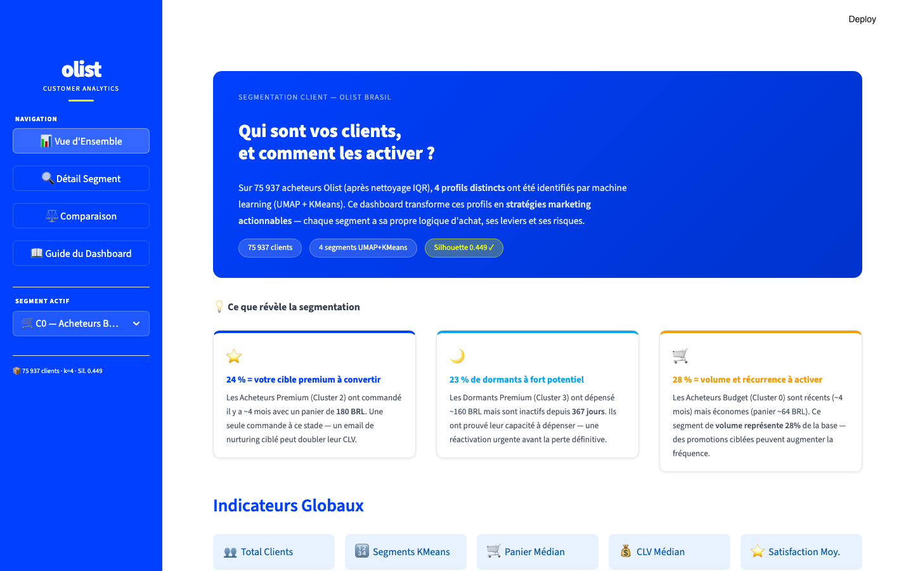
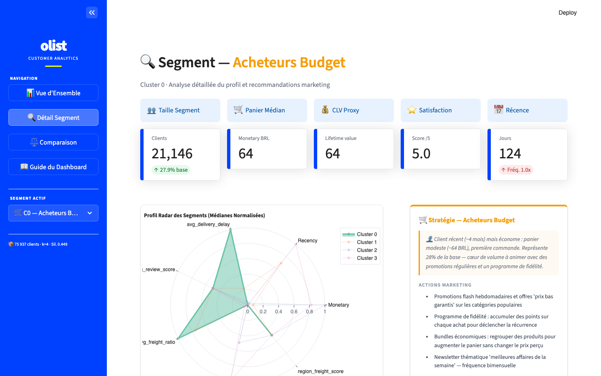
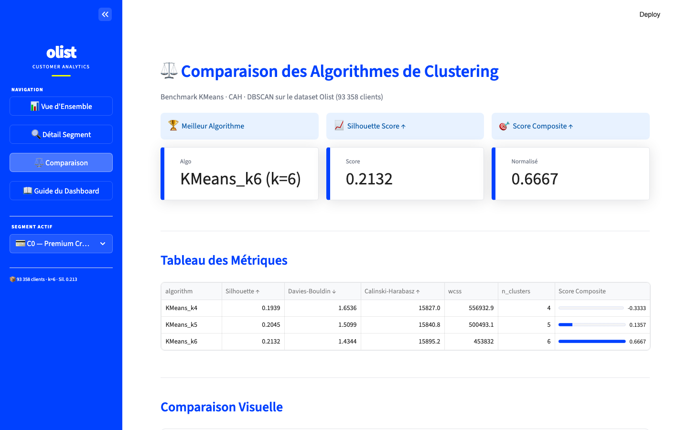
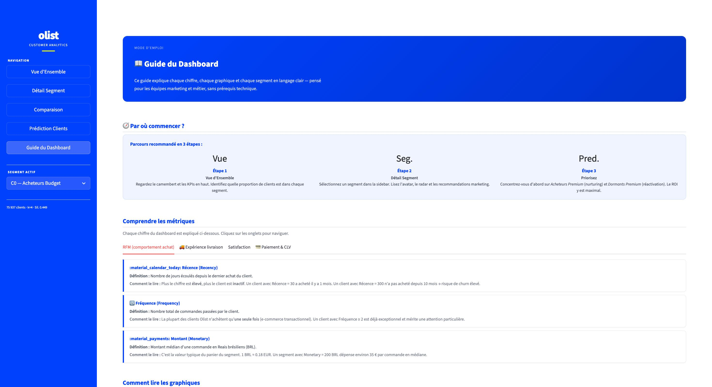

# Olist Customer Segmentation

> **Transformer 93 358 transactions en stratégies marketing actionnables grâce au Machine Learning**

---

## Le contexte

Olist est la principale marketplace e-commerce du Brésil, connectant des milliers de vendeurs indépendants à des millions d'acheteurs. Avec un dataset de **93 358 clients uniques**, **100 000+ commandes** et **8 millions de lignes de données relationnelles**, Olist dispose d'une mine d'informations comportementales — encore trop peu exploitée par les équipes marketing.

La question centrale : **qui sont réellement les clients Olist, et comment leur parler différemment ?**

---

## La problématique

Les équipes marketing opèrent sans visibilité claire sur la diversité des profils clients. Résultat :

- Des campagnes mass-market qui ignorent les clients à fort potentiel (Champions)
- Des clients insatisfaits qui partent sans qu'on les ait jamais contactés (Déçus)
- Un budget CRM dépensé indistinctement sur tous les segments, même les moins rentables

**Sans segmentation, toute stratégie marketing est une dépense à l'aveugle.**

---

## L'objectif

Construire un **système de segmentation client data-driven** de bout en bout :

1. Ingérer et modéliser les données dans PostgreSQL
2. Calculer des features RFM enrichies (récence, fréquence, montant, satisfaction, logistique)
3. Entraîner et comparer 3 algorithmes de clustering (KMeans, CAH, DBSCAN)
4. Déployer un dashboard interactif avec recommandations marketing par segment
5. Intégrer une IA générative (Gemini) pour produire des plans d'action concrets
6. Valider la stabilité temporelle du modèle et recommander une fréquence de ré-entraînement

---

## Résultats clés

| Segment | Clients | Part | Panier médian | CLV proxy | Signal principal |
|---------|---------|------|---------------|-----------|-----------------|
| 💳 Premium Crédit | 15 222 | 16% | 231 BRL | 231 BRL | Inactif depuis 8 mois — réactiver |
| 🐷 Économes Boleto | 18 238 | 20% | 98 BRL | 98 BRL | Prix-sensible — promotions ciblées |
| 📍 Périphériques | 8 651 | 9% | 37 BRL | 37 BRL | Fret = 84% du panier — urgence logistique |
| 👥 Mainstream | 38 000 | 41% | 96 BRL | 96 BRL | Cœur de cible — parrainage & volume |
| 🏆 Champions | 2 801 | 3% | 238 BRL | 476 BRL | CLV 3× la moyenne — rétention VIP |
| 😞 Déçus | 10 446 | 11% | — | — | Note 1/5 — récupération urgente |

**Algorithme retenu :** KMeans k=6 · Silhouette 0.213 · Davies-Bouldin 1.89

---

## Screenshots du Dashboard

### Vue d'Ensemble — Storytelling & KPIs



*Intro narrative avec les 3 insights critiques (Champions, Déçus, Périphériques), KPIs globaux, distribution par segment et heatmap des comportements.*

### Détail Segment



*Profil radar multi-dimensionnel, carte stratégie marketing, progress bar CLV vs. Champions, et plan d'action généré par Gemini AI.*

### Comparaison des Algorithmes



*Tableau de métriques (Silhouette, Davies-Bouldin, Calinski-Harabasz) et visualisation comparative. KMeans k=6 retenu.*

### Guide du Dashboard



*Mode d'emploi complet pour les équipes non techniques : définitions des métriques, lecture des graphiques, priorités par segment.*

---

## Architecture du projet

```
olist-customer-segmentation/
│
├── .github/workflows/             # CI/CD GitHub Actions
│   ├── ci.yml                     # Tests + black à chaque push
│   └── cd.yml                     # Build Docker + deploy Cloud Run (main)
│
├── data/                          # ⚠️ Non versionné — voir section Setup
│   ├── raw/                       # CSVs Olist originaux (Kaggle)
│   └── processed/                 # Parquets générés par les notebooks
│
├── notebooks/                     # Pipeline ML — exécuter dans l'ordre
│   ├── 01_eda.ipynb               # Exploration, distributions, corrélations
│   ├── 02_preprocessing_fe.ipynb  # Features RFM + livraison + satisfaction
│   ├── 03_clustering.ipynb        # KMeans / CAH / DBSCAN + comparaison
│   └── 04_simulation.ipynb        # Stabilité temporelle + feedback loop
│
├── src/                           # Modules de production
│   ├── data_loader.py             # Ingestion PostgreSQL → DataFrame
│   ├── features.py                # build_customer_features(), scale_features()
│   └── model_utils.py             # save_model(), load_model(), assign_clusters()
│
├── streamlit_app/                 # Dashboard interactif (point d'entrée unique)
│   ├── main.py                    # streamlit run streamlit_app/main.py
│   ├── styles.py                  # Thème Olist (bleu #0041FF / jaune #F0FF00) + apply_olist_theme()
│   ├── components/
│   │   ├── sidebar.py             # Navigation native st.button() + sélecteur de segment
│   │   ├── kpi_cards.py           # render_global_kpi_row(), render_segment_kpi_row()
│   │   ├── charts.py              # Figures Plotly (pie, bar, radar, heatmap)
│   │   ├── data_store.py          # Chargement parquets avec @lru_cache
│   │   ├── segment_recommendations.py  # Noms, avatars, recommandations par cluster
│   │   └── ai_insight.py          # Intégration Gemini API (gemini-2.5-flash)
│   └── views/
│       ├── overview.py            # Vue d'ensemble + storytelling + KPIs + charts
│       ├── segment_detail.py      # Profil segment + radar + IA Gemini
│       ├── comparison.py          # Benchmark algorithmes
│       └── guide.py               # Guide d'utilisation équipe métier
│
├── docs/
│   └── screenshots/               # Captures d'écran du dashboard
│
├── scripts/
│   └── generate_artifacts.py      # Génère tous les parquets sans Jupyter
│
├── tests/
│   ├── test_features.py           # Tests unitaires features.py
│   └── test_model_utils.py        # Tests unitaires model_utils.py
│
├── docker/
│   └── entrypoint.sh              # Démarrage Streamlit (production)
│
├── resources/                     # Notebooks de référence et inspiration
├── Dockerfile                     # Build multi-stage python:3.10-slim
├── requirements.txt
└── .streamlit/config.toml         # Thème clair Olist
```

---

## Prérequis

- Python 3.10+
- PostgreSQL 14+
- Compte Kaggle (pour télécharger le dataset)
- Clé API Gemini (optionnel — pour l'analyse IA dans le dashboard)

---

## Installation & Reproduction

### 1. Cloner le dépôt

```bash
git clone https://github.com/AliouneKane/olist-customer-segmentation.git
cd olist-customer-segmentation
```

### 2. Environnement virtuel

```bash
python3.10 -m venv venv
source venv/bin/activate        # macOS / Linux
# venv\Scripts\activate         # Windows

pip install -r requirements.txt
```

### 3. Données brutes (Kaggle)

Télécharger le dataset [Brazilian E-Commerce Public Dataset by Olist](https://www.kaggle.com/datasets/olistbr/brazilian-ecommerce) et décompresser dans `data/raw/` :

```
data/raw/
├── olist_customers_dataset.csv
├── olist_orders_dataset.csv
├── olist_order_items_dataset.csv
├── olist_order_payments_dataset.csv
├── olist_order_reviews_dataset.csv
├── olist_products_dataset.csv
├── olist_sellers_dataset.csv
└── olist_geolocation_dataset.csv
```

### 4. Variables d'environnement

Créer un fichier `.env` à la racine :

```env
# PostgreSQL
POSTGRES_HOST=localhost
POSTGRES_PORT=5432
POSTGRES_DB=olist
POSTGRES_USER=postgres
POSTGRES_PASSWORD=your_password

# Gemini API (optionnel)
GEMINI_API_KEY=your_gemini_api_key
```

### 5. Pipeline ML — exécuter les notebooks dans l'ordre

```bash
# Option A — Jupyter interactif
jupyter notebook

# Option B — Exécution headless (nbconvert)
MPLBACKEND=Agg jupyter nbconvert --to notebook --execute notebooks/01_eda.ipynb
MPLBACKEND=Agg jupyter nbconvert --to notebook --execute notebooks/02_preprocessing_fe.ipynb
MPLBACKEND=Agg jupyter nbconvert --to notebook --execute notebooks/03_clustering.ipynb
MPLBACKEND=Agg jupyter nbconvert --to notebook --execute notebooks/04_simulation.ipynb
```

> **Sur machine à mémoire limitée :** utiliser le script de génération directe qui contourne le kernel Jupyter :
> ```bash
> python scripts/generate_artifacts.py
> ```
> Ce script produit directement `cluster_profile.parquet`, `customer_features_labeled.parquet`, `model_comparison.csv` et les modèles `.pkl` dans `data/processed/`.

### 6. Lancer le dashboard

```bash
streamlit run streamlit_app/main.py
```

Ouvrir **http://localhost:8501** dans le navigateur.

**Pages disponibles :**
- **Vue d'ensemble** — distribution des segments, KPIs globaux, storytelling
- **Détail Segment** — profil radar, recommandations marketing, plan d'action IA
- **Comparaison** — benchmark des 3 algorithmes de clustering
- **Guide du Dashboard** — mode d'emploi pour les équipes non techniques

### 7. Tests

```bash
pytest tests/ -v
```

---

## Déploiement Docker

### Build et run local

```bash
docker build -t olist-segmentation .
docker run -p 8080:8080 --env-file .env olist-segmentation
```

### Google Cloud Run

Le pipeline CD se déclenche automatiquement sur push vers `main`.

Secrets GitHub requis :
- `GCP_PROJECT_ID`
- `GCP_CREDENTIALS` (JSON du compte de service GCP)

---

## Stack technique

| Couche | Technologies |
|--------|-------------|
| Données | PostgreSQL 14, pandas 2.2, pyarrow |
| Machine Learning | scikit-learn 1.5, scipy 1.13, MLFlow 2.13 |
| Visualisation | Plotly 5.22, Streamlit 1.50 |
| IA générative | Google Gemini 2.5 Flash |
| Tests | pytest 8.2, black 24.4 |
| Déploiement | Docker, Google Cloud Run |
| CI/CD | GitHub Actions |

---

## Fonctionnement du modèle

Le pipeline agrège toutes les tables au niveau `customer_unique_id` — **une ligne = un client** :

```
orders ──→ order_items ──→ products        ┐
orders ──→ order_payments                  ├──→ customer_features (RFM enrichi)
orders ──→ order_reviews                   │
orders ──→ customers ──→ geolocation       ┘
```

| Feature | Description |
|---------|-------------|
| `Recency` | Jours depuis le dernier achat |
| `Frequency` | Nombre total de commandes |
| `Monetary` | Montant médian par commande (BRL) |
| `avg_freight_ratio` | Frais de port / valeur commande |
| `avg_delivery_delay` | Écart livraison estimée vs. réelle (jours) |
| `avg_review_score` | Note satisfaction 1–5 |
| `avg_installments` | Nombre moyen de versements |
| `payment_type_cc_flag` | 1 = carte de crédit dominante |
| `region_freight_score` | Score logistique régional (1–5) |
| `CLV_proxy` | Monetary × Frequency |

---

## Auteurs

| Nom | Contribution |
|-----|-------------|
| **Khadidiatou Diakhaté** | Data Science & Feature Engineering |
| **Alioune Abdou Salam Kane** | Machine Learning & Model Evaluation |
| **Jacques Ily** | Data Engineering & Infrastructure |
| **Raherinasolo Ange Emilson Rayan** | Dashboard & Visualisation |

---

## Licence

Projet académique. Données publiques disponibles sur [Kaggle](https://www.kaggle.com/datasets/olistbr/brazilian-ecommerce) sous licence CC BY-NC-SA 4.0.
